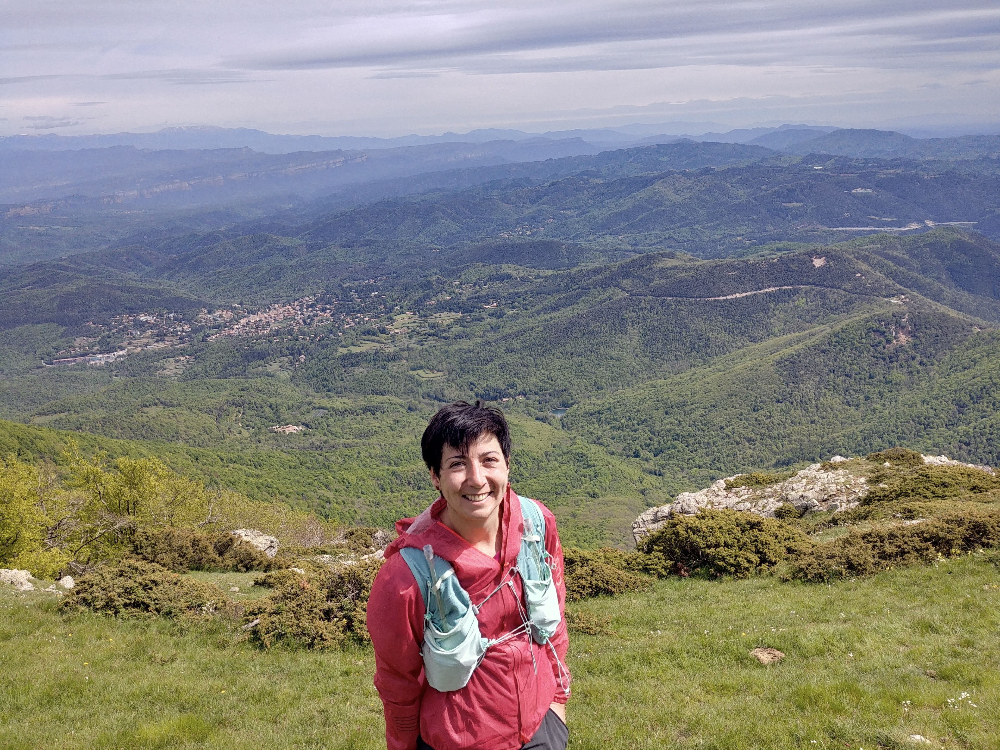

I am a postdoctoral researcher at [BCN-AIM lab](https://www.bcn-aim.org/) at the **University of Barcelona**. I am working on the project ["The Diversis Viis, Plurima Solvens (DVPS)"](https://www.bcn-aim.org/dvps/) with [Prof. Karim Lekadir](https://www.bcn-aim.org/about-us/the-team/). With this project we aim to advance multimodal foundation models for cardiology.

Before that, I was a postdoctoral researcher at [PURRlab](https://purrlab.github.io/) group at the **IT University of Copenhagen**. I was working on the project [“Making Metadata Count"](https://ameliajimenez.github.io/portfolio/portfolio-4) with [Prof. Veronika Cheplygina](https://veronikach.com/). With this project we investigated fair and robust evaluation, considering potential biases or shortcuts, and dataset management practices to improve transparency and reproducibility of ML models.

I graduated with a dissertation in **learning representations for medical image diagnosis** at the **Pompeu Fabra University**. I was part of the [BCN MedTech](https://www.upf.edu/web/bcn-medtech/) group and my PhD thesis was supervised by [Prof. Gemma Piella](https://www.upf.edu/web/simbiosys/entry/-/-/37215/adscripcion/gemma-piella) and [Prof. Diana Mateus](https://www.ls2n.fr/annuaire/Diana%20MATEUS/) (Ecole Centrale Nantes). During this time, I was an [INPhINIT](https://fundacionlacaixa.org/en/inphinit-doctoral-fellowships-call) fellow funded by “La Caixa” foundation and EU Horizon 2020 Marie Skłodowska-Curie programme. I hold a degree in Telecommunications Engineering from the **University of Granada** and a Master of Science in Biomedical Computing from the **Technical University of Munich**. During my master’s studies I was a research assistant at the Rechts der Isar Hospital of Munich.

Though I enjoy the math side of my work, I like getting out of the research bubble to **[disseminate](https://ameliajimenez.github.io/outreach/)** research to the general public. Dissemination is also an opportunity to break with **gender stereotypes**, give **visibility to diverse role models** and **empower** young girls to pursue scientific and technologic careers. With this aim I have contributed, with my two cents, in several **volunteering activities**.

In my free time, I enjoy going to the **cinema and concerts, reading, cooking and playing board games**. I probably spend most of my free time **traveling** and doing **sports**. I love spending time in nature, especially in the mountains. **Hiking**, **cycling**, and playing **football** are some of my favorite activities. My latest obsessions are watching [Pasta Grannies](https://www.youtube.com/@pastagrannies), making homemade pasta, and playing [Spirit Island](https://boardgamegeek.com/boardgame/162886/spirit-island). Happy to chat about any of that!

